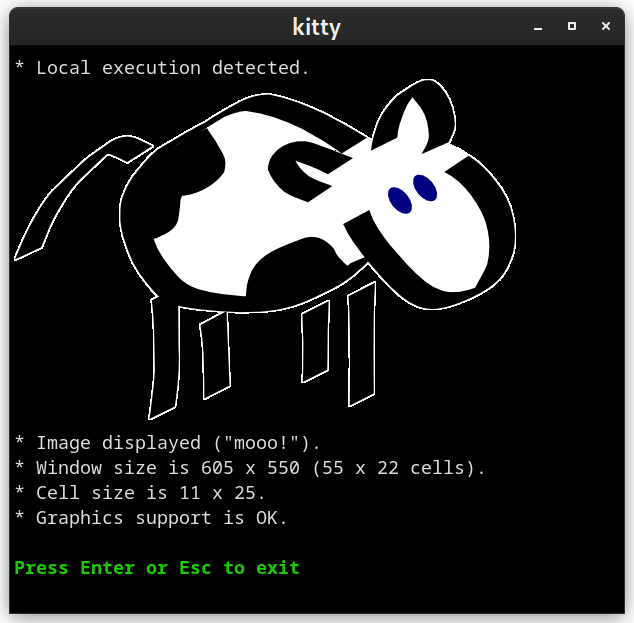

HOWTO use this repository
=========================

* Install gradle;
  - Use Arch Linux and install gradle through Pacman;
  - You could install [IntelliJ IDEA](https://www.jetbrains.com/idea/) if you need a complete editor too;
  - Or [SDKMan!](https://sdkman.io) if you are OK with unknown shell scripts running in your computer;
* Execute `gradle nativeBinaries` inside the root directory;
  - or `make`;
* Run sample binary in `build/bin/native/{debug|release}Executable/native-sample.kexe`;
  - or `make run`;

What does this program do?
--------------------------

It started as a sample terminal application written in [Kotlin native](https://kotlinlang.org/docs/native-overview.html) because I like the language but I don't like to be limited to the Android environment only. So I kinda turned it into a game development library for the [Kitty](https://sw.kovidgoyal.net/kitty) terminal. It will check if you are running Kitty and draw an image on the terminal. Just because it can. ;-)

Check the `src/nativeInterop/cinterop/kitty_extra.h` file for API.

Where to go from here?
----------------------

* https://kotlinlang.org/docs/native-gradle.html#build-and-run-the-application
* https://sw.kovidgoyal.net/kitty/
